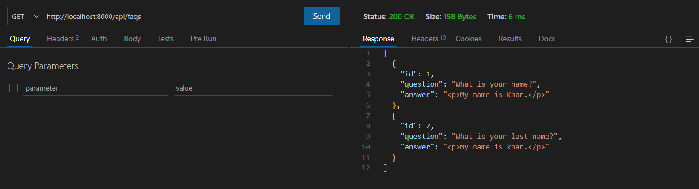

# Multilingual FAQ System (Backend Intern Assessment Solution)

A Django-based multilingual FAQ system with REST API support, caching using Redis, and automatic translations via Google Translate.

---

## Table of Contents

1. [Features](#features)
2. [Installation](#installation)
3. [Usage](#usage)
   - [Admin Panel](#admin-panel)
   - [API Endpoints](#api-endpoints)
4. [Caching](#caching)
5. [Testing](#testing)

---

## Features

- **Multilingual Support**: FAQs can be translated into multiple languages (e.g., Hindi, Bengali).
- **WYSIWYG Editor**: Use `django-ckeditor` for rich text formatting in answers.
- **REST API**: Fetch FAQs in different languages using query parameters.
- **Caching**: Improve performance with Redis caching on API responses.
- **Automatic Translations**: Use Google Translate API to automatically translate FAQs during creation.
- **Admin Panel**: Manage FAQs through a user-friendly Django admin interface.

---

## Installation

### Prerequisites

- Python 3.8 or higher
- Redis (for caching)
- Git (optional, for cloning the repository)

### Steps

1. **Clone the Repository**

   ```bash
   git clone https://github.com/Tusshar10/faq-backend.git
   cd faq_project
   ```

2. **Set Up Virtual Environment**

   ```bash
   python -m venv venv
   source venv/bin/activate  # On Windows use `venv\Scripts\activate`
   ```

3. **Install Dependencies**

   ```bash
   pip install -r requirements.txt
   ```

4. **Start Redis Server** (Make sure Redis is installed on your system)

   ```bash
   redis-server
   ```

5. **Apply Migrations**

   ```bash
   python manage.py migrate
   ```

6. **Create Superuser**

   ```bash
   python manage.py createsuperuser
   ```

7. **Run the Development Server**
   ```bash
   python manage.py runserver
   ```

### Usage

#### Admin Panel

1. Access the admin panel at http://127.0.0.1:8000/admin.
2. Log in with your superuser credentials.
3. Add FAQs under the "FAQs" section.

#### API Endpoints

1. **Default Language (English)**
   ```bash
   curl http://127.0.0.1:8000/api/faqs/
   ```

2. **Hindi**
   ```bash
   curl http://127.0.0.1:8000/api/faqs/?lang=hi
   ```

3. **Bengali**
   ```bash
   curl http://127.0.0.1:8000/api/faqs/?lang=bn
   ```

#### Response Example




## Caching

Redis is used to cache API responses for improved performance. Cached data expires after 400 seconds.


## Testing

Run tests using pytest:

```bash
pytest
```

---


